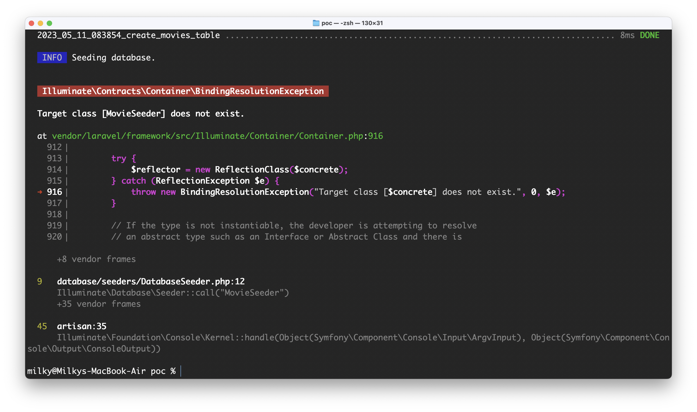

## Laravue

> __Story__ Investigate possible approaches to porting a monolithic Laravel/Vue applications into multiple, more scaleable, more manageable and modern apps 

### Overview 

The problem lies [here](https://blog.logrocket.com/create-single-page-app-laravel-and-vue/#why-are-laravel-and-vue-good-together)

Not long ago the befefits of using a tightly integrated approach to Laravel/Vue developments included ...

"__The source code is combined into one project, rather than having separate projects for the backend and frontend__"

Although reasonable, that can result in a monolithic app and is no longer desirable  

#### Possible approach

GraphQL could be help. It's easy to teach the existing system to speak GraphQL ising a laravel plugin like **rebing/graphql-laravel**

```bash
// Install library
$ composer require rebing/graphql-laravel
```

If all new features/components development speak to the same GraphQL API by default, then you have a situation where the Laravel LAMP backend starts to sepearate from the frontend micro-app components. At the same time, the Existing backend is does not need to change, so backward compatibility is avaioded

___

### Proof of Concept (Movies)

[🤙 Movies](./movies)

__Note:__ If a POC takes too long to make, then the concept might need re-think

#### Required

- PHP 7+
- Composer 2.0

#### Good to have

- Basic knowledge of Laravel (Eloquent, Migrations, MVC, Routes, and more)
- Basic knowledge of GraphQL (in theory)
- Some knowledge of PHP (Syntax, OOP, and more)

#### Walkthrough

Start by working through this [tutorial](https://www.atatus.com/blog/how-to-use-laravel-to-create-a-graphql-api/) whose goal is to 

> Teach some of the core ideas needed to create a GraphQL API that uses Laravel. We will take a novel way to construct REST APIs in this lesson, which departs from traditional architecture. We'll create a theatre (movie list) API that can do CRUD (Create, Read, Update, Delete) actions on data in your database to help us learn more about GraphQL

```bash
cd <working-dir>
git clone https://github.com/listingslab-software/laravue
cd laravue
npm i
npm start
```
## ! Error




OK, so that's bad & a potential timesink, so let's for now assume that we have a valid GraphQL server we can query

### New Vue App

The idea here is to create an entirely independent Vue component/app/microfrontend/microapp (call it what you like) which can connect to the GraphQL API we created above. Too easy. The trick will be making one which allow developers to easily port exising Vue components into the same pattern.

#### Vue CLI

Use the [CLI tool](https://github.com/vuejs/create-vue) to create a new Vue App

- Using a Vue version of Material UI, [vuematerial](https://www.creative-tim.com/vuematerial/)
- Using Vite https://vitejs.dev/guide/

